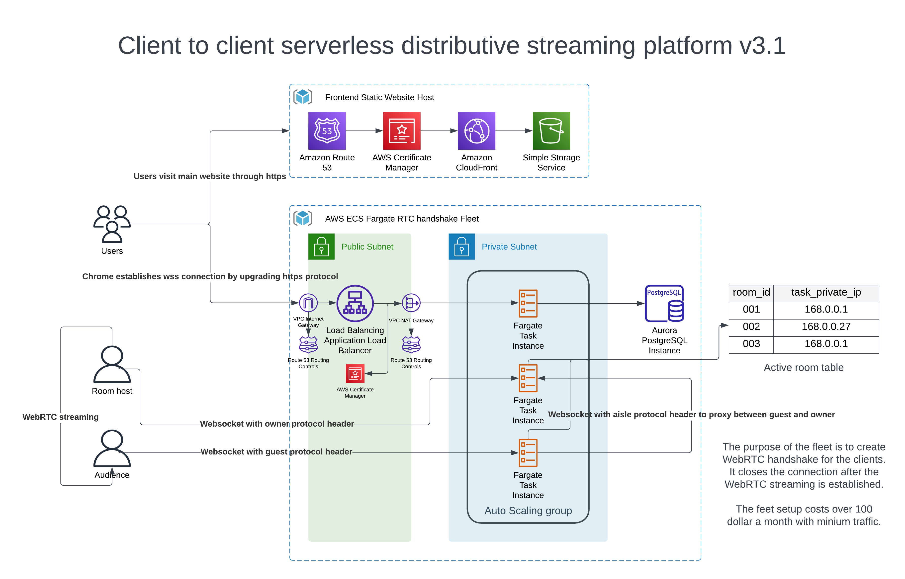

​​# Virtual-Avatar

A web-based virtual face renderer and streaming platform inspired by the Metaverse. 

Please follow [User Guide.md](./userguide/README.md) on how to use the website.

Website is published on aws: https://virtualavatar.trip1elift.com/ 

Resources: Route53, Certs, CloudFront, S3 

Frontend Core Technologies: ReactJS, Google Mediapipe, ThreeJS, React-Three-Fiber, WebSocket, WebRTC, Terraform, AWS 

## Outlook 
The virtual avatar has a streaming backend to support video chat using virtual face mesh. You can also use it as a static website to play around with your virtual 3D mesh face. The architecture design is shown in the diagram below. 

 

Backend repo: https://github.com/Trip1eLift/virtual-avatar-stream 

The website can only run in Chrome on a PC or Mac. It does not support Safari or Mobile devices due to the usage of some specific browser API. However, the legacy V1 site supports both Safari and Mobile devices, although it does not support client-to-client streaming.

Legacy V1 site: https://v1-virtualavatar.trip1elift.com/

## Site setup

### 1. `npm install`
Install all the dependencies

### 2. `make start`
It runs npm start to start the app for you.

### 3. `make dev`
It runs build and serve the built website. `npm i serve -g` is required before you can run this.

### 4. `make deploy`
Deploy code and infrastructure to aws cloud using terraform.

### 5. `make destroy`
Delete code and infrastructure from aw.