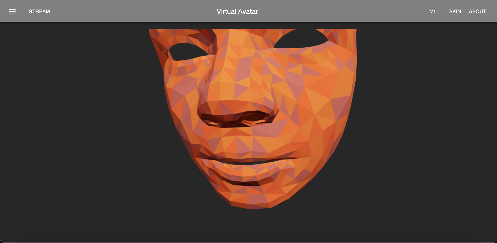
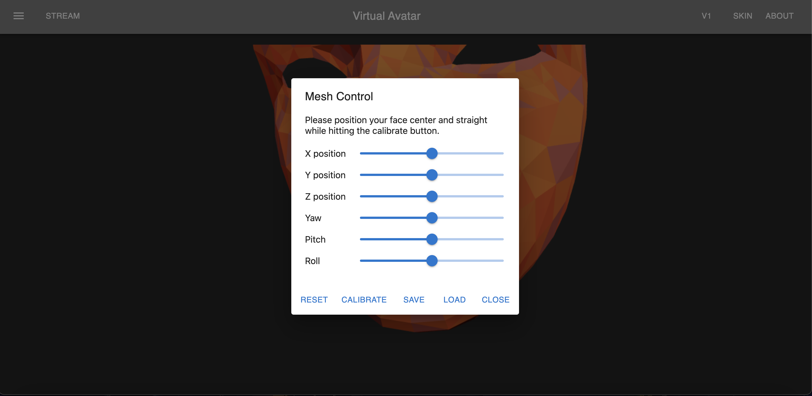
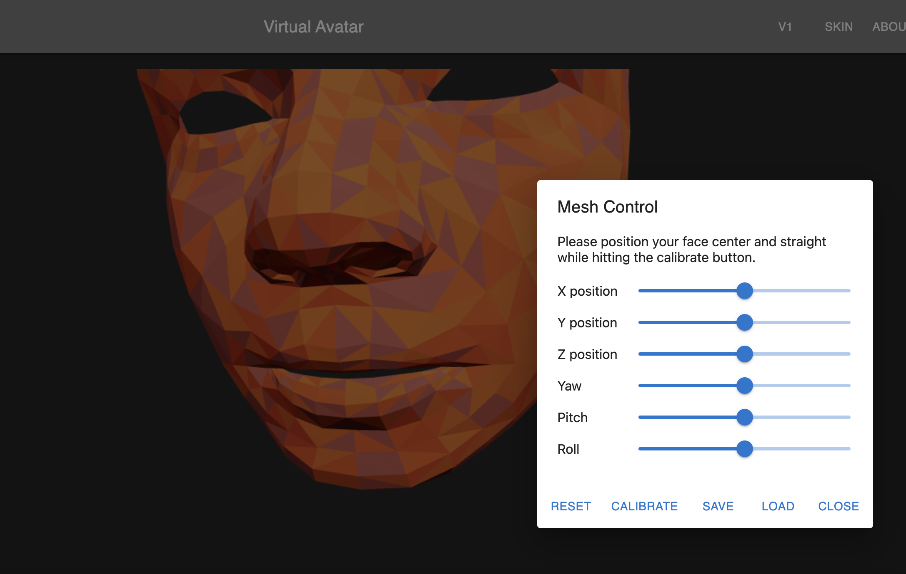
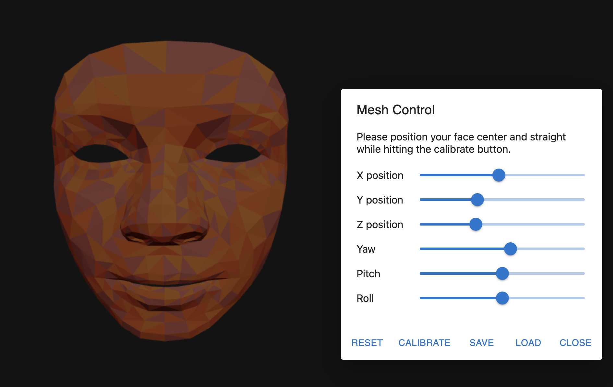
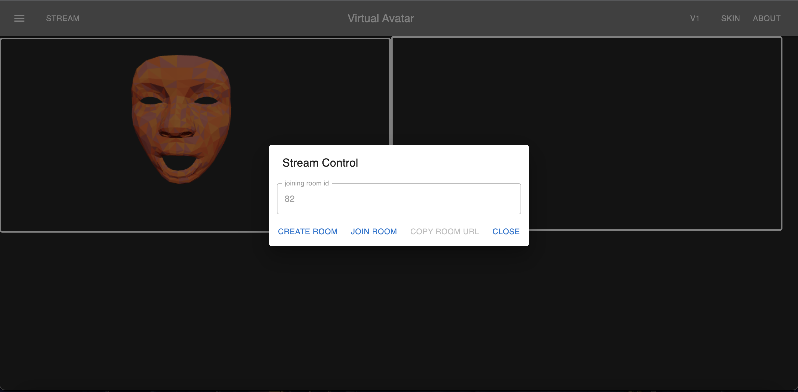
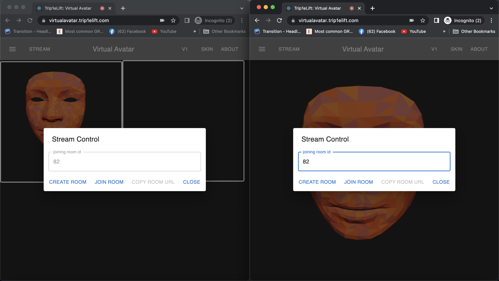
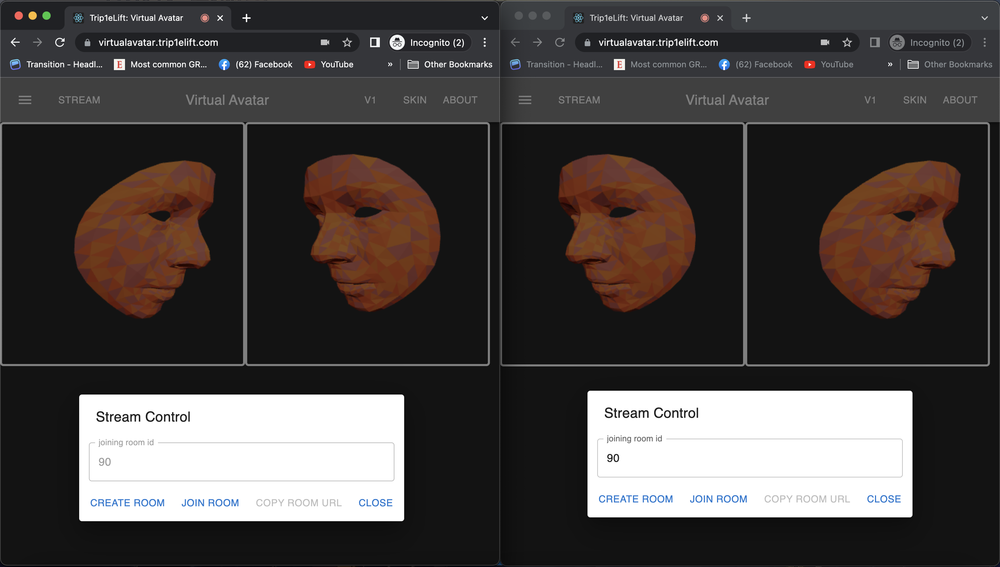

# User Guide 

### 0. Browser usage
It only supports Chrome on a PC or Mac. It does not support Safari or Mobile devices.

### 1. Visit page 

When you first visit the page (https://virtualavatar.trip1elift.com/), it will ask you to grant access to your camera and microphone. Please select `Allow`. 
 

### 2. Rendering your 3D face mesh 

You should see your 3D face moving in real-time after a short delay. 
 

### 3. Settings 

On the top left corner, there is a setting button. Click the setting button to open the mesh control panel. 
 

### 4. Mesh control 

The mesh control panel should look like this when it opens for the first time. 
 

### 5. Draggable panel 

The mesh control panel is draggable. So you can put it on the side when you modify the settings. 
 

### 6. Calibration and save settings 

Please look at the camera while having your face upright. And click `calibrate`. It will try its best to auto-calibrate your face with the mesh relative to the camera. You can use the bar to modify the calibration as you wish manually.

Once the mesh is aligned, you can hit `save` to save the settings. The next time you visit the page, it will automatically load your settings. And you can always load your last save if you want to revert some changes. 
 

### 7. Streaming 

Next to the setting button on the top left, there is a `stream` button. Hit it to open the stream control panel. 
 

### 8. Stream Control 

The stream control panel has `create room` and `join create` buttons. For room creation, it will self generates a `room id`. Enter the `room id` your friend has created for you to join the room. 
 

### 9. Create a room 

If you hit `create room`, you should see two mesh windows behind the panel, and you should also see a `room id` generated. You can send the `room id` to your friend, so the person can use it to join your room. 
 

### 10. Join a room 

Your friend can enter the room by typing your room's id and hitting `join room`. 
 

### 11. Stream starts 

Once your friend joins the room, the face mesh and audio streaming should start. You can drag or close the stream control panel. Note that no video data is being sent, so you're safe if you don't want to show your face. 
 

### 12. Skin color 

On the top right corner, there is a `skin` button. You can hit to switch to different skins.
 
